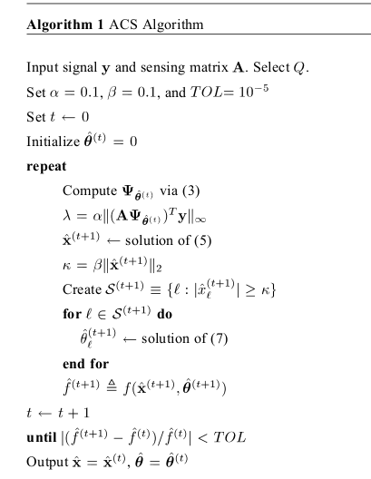
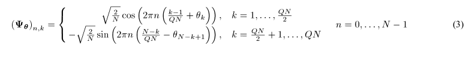
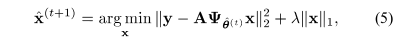
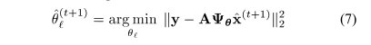

# Alternating Convex Search (ACS)

Here we are trying to estimate both frequency bases matrix and coefficients.

## Algorithm









## Running Instruction

### File Structure

- [`myScript.m`](https://github.com/kalpeshdusane/Reducing-Basis-Mismatch-using-Alternating-Convex-Search/blob/master/Code/myScript.m) - main file from where all the code is called; run this file to excute this project.
    
- [`generate_input.m`](https://github.com/kalpeshdusane/Reducing-Basis-Mismatch-using-Alternating-Convex-Search/blob/master/Code/generate_input.m) - To generate the input signal
    
- [`basis.m`](https://github.com/kalpeshdusane/Reducing-Basis-Mismatch-using-Alternating-Convex-Search/blob/master/Code/basis.m) - to generate basis from equation 3
    
- [`Run_ACS.m`](https://github.com/kalpeshdusane/Reducing-Basis-Mismatch-using-Alternating-Convex-Search/blob/master/Code/Run_ACS.m) - a collection of generating input, call ACS and other tasks 
    
- [`ACS.m`](https://github.com/kalpeshdusane/Reducing-Basis-Mismatch-using-Alternating-Convex-Search/blob/master/Code/ACS.m) - Actual ACS Algorithm
    
- [`l1_ls.m`](https://github.com/kalpeshdusane/Reducing-Basis-Mismatch-using-Alternating-Convex-Search/blob/master/Code/l1_ls.m) - To solve the equation 5
    
- [`ISTA.m`](https://github.com/kalpeshdusane/Reducing-Basis-Mismatch-using-Alternating-Convex-Search/blob/master/Code/ISTA.m) - instead of l1_ls solver we can use ISTA (Iterative Shrinkage-Thresholding Algorithms)
    
### Structure of L1_LS Solver

Here to solve  problem(*equation 5*), I have used well-known package L1_LS from https://stanford.edu/~boyd/l1_ls/

Following is ReadMe for L1_LS Solver :
```
l1_ls: A Matlab solver for l1-regularized least squares problems.

BETA version, May 10 2008

COPYRIGHT (c) 2007  Kwangmoo Koh, Seung-Jean Kim and Stephen Boyd.

Permission to use, copy, modify, and distribute this software for
any purpose without fee is hereby granted, provided that this entire
notice is included in all copies of any software which is or includes
a copy or modification of this software and in all copies of the
supporting documentation for such software.
This software is being provided "as is", without any express or
implied warranty.  In particular, the authors do not make any
representation or warranty of any kind concerning the merchantability
of this software or its fitness for any particular purpose.

--------------------------------------------------------------------------------

Please see the comments in the source code, for more information.

--------------------------------------------------------------------------------
Files of interest:

SOLVERS
    l1_ls.m : main solver
    l1_ls_nonneg.m : main solver (with non-negativity constraints)

EXAMPLES
    simple_example.m : example for the basic usage
    operator_example.m : example that illustrates the object 
                         programming feature of Matlab

UTILITY
    find_lambdamax_l1_ls : utility file for finding maximum value of lambda
    find_lambdamax_l1_ls_nonneg : finding maximum value of lambda of
                              l1-regularized LSP with nonnegativity constraints

```
